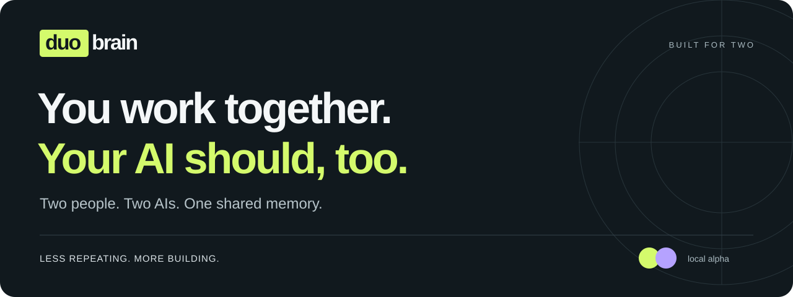

<p align="center">
  
</p>

<p align="center">
  <a href="https://duobrain.pages.dev"><strong>Try the demo ↗</strong></a> ·
  <a href="#get-started"><strong>Get started</strong></a> ·
  <a href="docs/agent-guidance/repository-onboarding.md">Full walkthrough</a> ·
  <a href="GETTING_STARTED.md">한국어</a>
</p>

<p align="center">
  
  
  
</p>

**Pick up the work, without retelling the story.**

Your partner figured something out with their AI. Now you need the reasoning, the prompt, or just a clear next step.

**duobrain gives two people and their existing AIs a shared project memory, backed by Git.** Connect your project, give each AI the collaboration guide, and keep plans, decisions and handoffs useful beyond a single chat.

## Start with a question

| Ask your AI… | Pick up… |
| --- | --- |
| “Where did my partner leave off?” | Shared goals, work scopes, blockers and the next step. |
| “How did my partner get this working?” | Source notes and captured prompts or harnesses—the setup used to run and evaluate the AI. Compare the evidence you both shared. |
| “Can you get the missing detail?” | An information request for your partner's next AI session, with a source-backed answer to follow. |
| “What does my partner think?” | A feedback request that keeps your partner's own judgment attached to the decision. |

Your AI checks shared records first. If something is missing, it leaves a request. Your partner's AI can answer when they next use it; after syncing, yours can continue with the new evidence. **The handoff survives the conversation.**

Keep the bigger picture in the **local dashboard**: goals, assignments, recent work, open requests and resolved history. The **shared wiki** keeps sources traceable, with on-demand **refinement** to revisit importance and recency while preserving original notes.

> Want to see the idea first? The [web demo](https://duobrain.pages.dev) is a guided experience with example data. Follow the steps below to connect the local engine to your own project.

## Get started

You'll need **Node.js 22+**, **Git**, and one clone per person of the same product repository. Both clones need the same `origin` remote and permission to push collaboration records to it. **No `npm install` needed.**

### 1. One person adds duobrain to the project

The first person downloads duobrain once, anywhere, and installs it **into the product repository**:

```sh
git clone --depth 1 --branch v0.1.1 https://github.com/slowspurt/duobrain.git /tmp/duobrain
cd /path/to/product
node /tmp/duobrain/bin/duobrain.js install
node .duobrain/bin/duobrain.js init --participants member-a,member-b --participant member-a
git add .duobrain AGENTS.md CLAUDE.md .gitattributes
git commit -m "chore: add duobrain"
git push
```

`install` copies duobrain's runtime files (about 400KB, no dependencies) into `.duobrain/` and pins the version in `.duobrain/VENDOR.json`. It also writes a short duobrain block into `AGENTS.md`, an `@AGENTS.md` import into `CLAUDE.md`, and a `.gitattributes` line that marks `.duobrain/` as vendored. The downloaded folder is no longer needed. This is called **vendoring**; see [why duobrain is vendored](docs/vendoring.md).

### 2. The other person just joins

```sh
git pull
node .duobrain/bin/duobrain.js init --participant member-b
```

There is nothing to download: the tool arrived with the project, and the participant pair is read from the shared record. Codex, Cursor and other tools read `AGENTS.md`; Claude Code reads it through `CLAUDE.md`, so each person's AI already knows how to run duobrain. Check the connection with:

```sh
node .duobrain/bin/duobrain.js sync
node .duobrain/bin/duobrain.js status --brief
```

If delivery is `pending` (exit code `2`), fix the Git connection or push permissions and retry `sync`. Collaboration records use a separate `duobrain/state` branch; syncing them does not commit or merge your product code.

### 3. Ask your AI

Try asking: **“Where did my partner leave off, and what can I pick up?”** On a fresh setup, share a kickoff note first so your AI has something to work from. The [starting-plan recipe](docs/agent-guidance/repository-onboarding.md#2-share-and-record-the-starting-plan) walks through it. If your AI ignores `AGENTS.md`, tell it once: "Read AGENTS.md and follow the duobrain block."

Your existing AI follows the block when you use it. Setup does not start a background AI service.

<details>
<summary><strong>Prefer one global install instead?</strong></summary>

Clone duobrain outside the product, run `npm link` there, and use `duobrain init --participants … --participant …` in each product clone. Both people then install duobrain themselves; the `AGENTS.md` block tells each AI to find the guide with `duobrain guide`.

</details>

### 4. See your shared context

```sh
node src/dashboard/run.js --repository /path/to/product
```

Open [localhost:4173](http://127.0.0.1:4173). The dashboard reads your local collaboration records; run `sync` to bring in your partner's updates. A recorded session shows what was shared, not whether your partner is online.

<details>
<summary><strong>Just browsing? Run the sample dashboard locally</strong></summary>

From the duobrain checkout, run without a product path:

```sh
node src/dashboard/run.js
```

Open [localhost:4173](http://127.0.0.1:4173) to explore sample records. Stop it with Ctrl+C before starting the dashboard for your real project on the same port.

</details>

## Update duobrain

```sh
node .duobrain/bin/duobrain.js update --check   # show the newest release; changes nothing
node .duobrain/bin/duobrain.js update           # replace .duobrain with the newest release
git add .duobrain AGENTS.md && git commit -m "chore: update duobrain"
```

`update` downloads the newest `vX.Y.Z` release, replaces `.duobrain/`, and refreshes the `AGENTS.md` block with the new code. One person updates and commits; the other just pulls, so both always run the same version. Pin a version with `--ref v0.1.1`. It refuses to overwrite committed files in `.duobrain/` that were edited locally. With a global install, `update` fast-forwards the duobrain checkout instead.

## Everyday commands

Your AI can run these under your existing authorization. With a vendored install, run `node .duobrain/bin/duobrain.js <command>` from the product root; the examples below use the global form with an explicit product path. Commands return JSON; writes save collaboration records locally and attempt to push. For `pending` / exit code `2`, retry `sync` rather than creating the record again.

<details>
<summary><strong>Start work → leave a handoff</strong></summary>

Sync and read the shared context before choosing a scope:

```sh
node bin/duobrain.js sync --repository /path/to/product
node bin/duobrain.js status --repository /path/to/product
node bin/duobrain.js start --repository /path/to/product \
  --title "Build the export screen" --scope src/export --actor ai
```

Save the returned `event.entityId`. Replace `YOUR_SESSION_ID` with it when you finish:

```sh
node bin/duobrain.js end --repository /path/to/product \
  --session YOUR_SESSION_ID --summary "Export screen connected and checked" \
  --next "Confirm the empty-state behavior" --actor ai
```

For parallel work, [check your partner's recorded scope](docs/agent-guidance/repository-onboarding.md#7-check-bs-recorded-work-before-parallel-work) before starting.

</details>

<details>
<summary><strong>Ask for evidence or a person's feedback</strong></summary>

```sh
node bin/duobrain.js ticket-create --repository /path/to/product \
  --kind information --title "Which export harness did you use?" \
  --body "Share the captured prompt, harness version and source note." --actor ai
```

Use `--kind feedback` when the answer needs your partner's judgment. Feedback responses must come from the person or transcribe their explicitly confirmed words. An answer stays open until the requester resolves it.

Follow the [complete request walkthrough](docs/agent-guidance/repository-onboarding.md#4-work-one-complete-information-request) for acknowledgment, evidence, response and resolution.

</details>

<details>
<summary><strong>Find and compare shared methods</strong></summary>

```sh
node bin/duobrain.js wiki-search --repository /path/to/product \
  --query "export harness"
node bin/duobrain.js method-compare --repository /path/to/product \
  --file /path/to/comparison.json
```

Create `comparison.json` from the [comparison example](docs/engine/README.md#shared-wiki-discovery-and-method-comparison), using your actual shared notes and captured prompt/harness text. Missing evidence stays unknown. Add `--request-missing --actor ai` to create or reuse an information request within your agreed sharing scope.

</details>

<details>
<summary><strong>Refresh the wiki index on demand</strong></summary>

When you want an updated importance and recency index, prepare the [refinement config](docs/engine/README.md#wiki-refinement-execution) and run:

```sh
node bin/duobrain.js wiki-refine --repository /path/to/product \
  --file /path/to/refinement.json
```

Either participant can run it. Original notes are preserved; the summary is shared after push. Running again with no new notes, tickets or policy change on the same date is skipped.

</details>

For all commands, run `node bin/duobrain.js --help` or read the [CLI reference](docs/engine/README.md). The [AI collaboration guide](guides/duobrain-ai.md) is in English; the [dashboard guide](docs/dashboard/README.md) is currently in Korean.

## AI-led first run

> **Current alpha.** The CLI provides resumable onboarding state, authenticated GitHub CLI account lookup and editable nickname profiles. Your existing AI performs the project reading and asks for missing facts. The locale preference is stored locally; dashboard language controls and translated UI text are not included in this integration.

After downloading duobrain, tell your existing AI:

**“Set this project up for collaboration with duobrain.”**

Point the AI to [`guides/duobrain-onboarding.md`](guides/duobrain-onboarding.md). The download does not start an AI process.

From there, your AI guides you through four steps:

1. **Resume or inspect.** Read the saved onboarding stage first. Your existing AI checks permitted project material and proposes new project, existing project, or second-participant join with the evidence it used.

2. **Make it yours.** Use your GitHub username when the authenticated `gh` account can be confirmed; otherwise, ask once or continue without one. Shared records retain the immutable participant ID, while an editable nickname can change without losing history.

3. **Pick up and review the plan.** Read the project brief and meeting notes first. Ask only for missing context, then prepare a concrete revision with each person's scope, goals and handoff conditions. Keep existing agreements distinct from new AI proposals. One person's approval does not count as both people's agreement.

4. **Start with a clear next step.** After review, save and sync the permitted plan and connect the first task to the existing session workflow. Only report shared setup as complete when the records have actually synced.

**Joining second? Pick up where your partner left off.** Your AI reads the shared plan, helps you set your nickname and review your assigned scope, then gets you started. You don't repeat the full planning interview.

The dashboard locale setting is a per-clone preference, stored as `system` by default. It does not add a language question to onboarding or translate shared source text.

## Help shape the alpha

The local alpha has passed **87 tests**, including onboarding and two-clone collaboration flows, plus a clean local-clone check. Acceptance testing with two people on separate machines and their existing AI tools is **still pending**. See [verification details](docs/implementation-status.md).

Try a small shared project and [tell us what happened](https://github.com/slowspurt/duobrain/issues): what you asked, what you expected and where the handoff fell short. Include a shareable example.

**License:** [MIT](LICENSE). See the [v0.1.0 release notes](docs/releases/v0.1.0.md) for distribution and current limits.

---

<p align="center"><strong>Less repeating. More building. Together.</strong></p>
